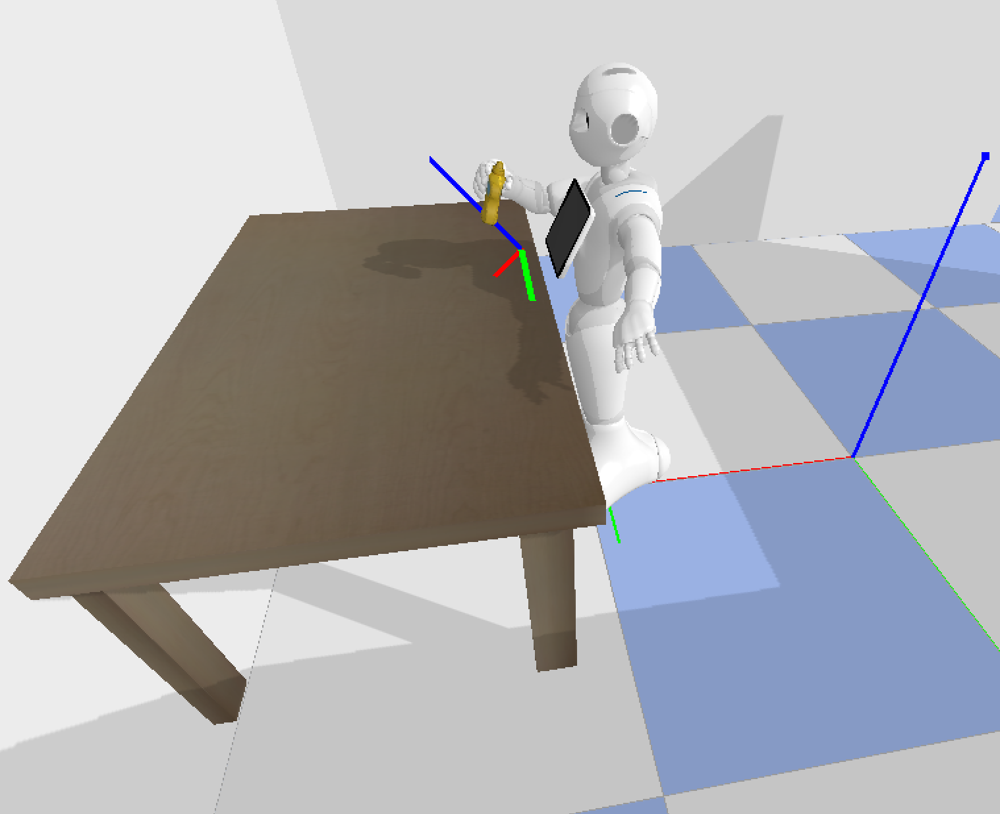
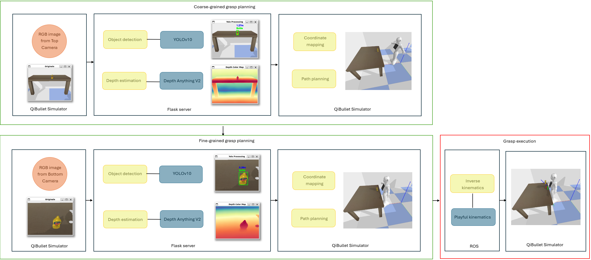

# Design and Implementation of a Novel Grasping System for a Humanoid Robot in QiBullet Simulator

## 📖 Project Overview
This thesis presents the design and implementation of a **grasping system** for the **Softbank Robotics Pepper humanoid robot** within the **QiBullet simulator**.  

The system enables Pepper to **detect, localize, and grasp unknown objects** without relying on external markers or additional sensors, using only the hardware it is already equipped with.  

This work is significant because grasping is not a typical skill for social humanoid robots like Pepper. Enhancing this capability not only poses a technical challenge but also broadens the potential applications of the robot.

---

## 🤖 Robot and Simulator
- **Robot**: Softbank Robotics **Pepper**  
  - 20 Degrees of Freedom (DOF)  
  - Two 640×480 cameras (forehead and mouth)  
  - Limited hands (fully open/close, max 200g payload)  
  - VisionLab model includes stereo cameras behind the eyes (not supported in QiBullet)  

- **Simulator**: **QiBullet** (based on Bullet physics engine)  
  - Simulates gravity, friction, and physical interactions  
  - Calibrated simulated cameras to match real Pepper
 

  

---

## ⚙️ Technical Framework
The grasping system is fully **modular** and developed in **Python**.  

### 🔑 Key Modules
- **Object Detection** → YOLOv10 (small version) is used to identify and outline target objects in images from Pepper’s cameras.  
- **Depth Estimation** → Monocular approach with **Depth Anything V2**, generating a depth map from a single image.  
- **Coordinate Mapping** → Transforms 2D image coordinates into the robot’s **3D base coordinate system**.  
- **Path Planning** → Optimizes the robot’s arm trajectory (position, orientation, and distance) to achieve the best grasping pose.  
- **Inverse Kinematics** → Implemented using the **Playful Kinematics** framework. Computes joint configurations for Pepper’s **arms and lower body** to ensure efficient and natural movements.

---

## 🔄 System Workflow
1. Pepper rotates to detect a target object (a small bottle on a table).  
2. **Forehead camera** captures images at 15 FPS → sent to a Flask server for detection and depth estimation.  
3. Once closer, the **mouth camera** provides detailed close-range images → processed again for improved accuracy.  
4. **Path Planning** adjusts robot’s position and orientation.  
5. **Inverse Kinematics** executes the grasp.

  

---

## 📊 Results
- **25 simulations** were conducted.  
- A grasp was considered successful if Pepper could reach and lift the bottle.  
- **Success rate: 72%**

While the simulator lacks real-world variability (lighting, noise), the system showed strong **robustness and reliability**, making it suitable for future real-world testing on the physical Pepper robot.  

The **modular design** also allows adaptation to other humanoid platforms.

---

## 🚀 Future Work
- Improve grasping for **more complex objects**.  
- Extend modular framework to **other humanoid robots**.  

---

## 🎥 Demonstrations  

Full [demo video](https://drive.google.com/file/d/1-bnVR9A43_qvN2H7tZ9QyVUDxzcZhbbf/view)

---
